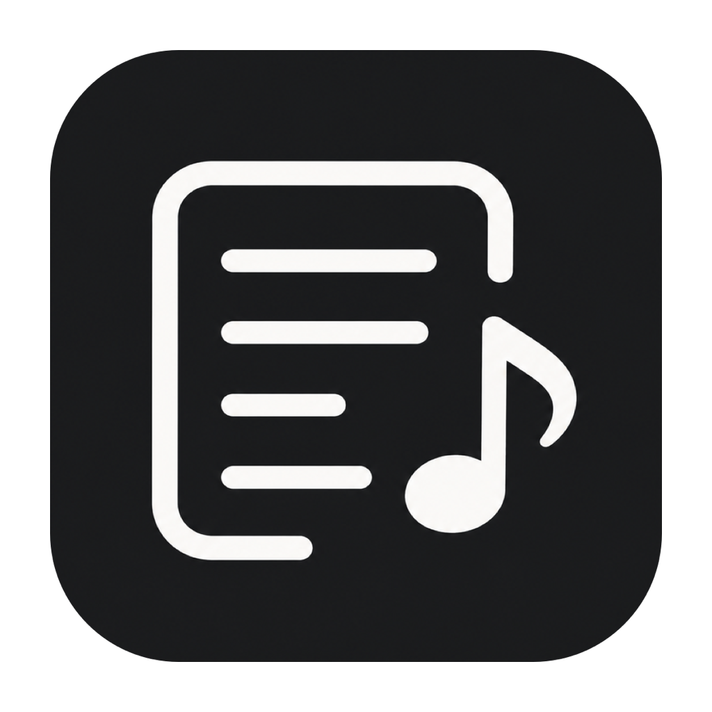

<p align="center">
  
</p>

# LyricFloat

[](https://www.apple.com/macos/)
[](https://www.swift.org/)
[](https://github.com/zhiyangx27-byte/LyricFloat/actions/workflows/ci.yml)
[](LICENSE)

LyricFloat 是一款原生 macOS 菜单栏应用，为 Apple Music 显示可定制的悬浮歌词。它优先使用同步 LRC，支持保守的 LRCLIB 自动匹配、手动选择歌词版本、本地 LRC 覆盖和逐曲时间偏移。

## 功能

- 原生 SwiftUI/AppKit 菜单栏应用，不占用 Dock
- LRCLIB 精确查询、清理元数据搜索、候选评分和低可信度拒绝
- 手动选择 LRCLIB 歌词版本，并可随时恢复自动匹配
- 导入本地 LRC，优先级高于所有在线来源
- 字体、字号、行距、颜色、透明度、对齐和背景自定义
- 自动读取本机字体，例如 Arial；另一台 Mac 缺少所选字体时回退系统圆体
- 原生窗口拖动、缩放、固定、点击穿透和一键移回当前显示器中央
- 多桌面与全屏应用显示、全局显示快捷键、登录时启动
- 手动隐藏后保持隐藏，歌曲切换时仍在后台刷新歌词

## 系统要求

- macOS 15 或更高版本
- Apple Music
- LRCLIB 查询所需的网络连接
- 从源码构建时需要 Swift 6；推荐安装 Xcode 16 或更高版本

## 快速开始

```bash
git clone https://github.com/zhiyangx27-byte/LyricFloat.git
cd LyricFloat
./script/build_and_run.sh
```

也可以在 Xcode 中打开 `LyricFloat.xcodeproj`，选择 `LyricFloat` scheme 后运行。

首次读取歌曲时，macOS 会请求允许 LyricFloat 访问 Apple Music。若曾拒绝，可前往“系统设置 → 隐私与安全性 → 自动化”，允许 LyricFloat 控制“音乐”。

### 构建命令

| 命令 | 作用 |
| --- | --- |
| `./script/build_and_run.sh` | Debug 构建并启动 |
| `./script/build_and_run.sh test` | 运行全部单元测试 |
| `./script/build_and_run.sh build` | 仅生成 Debug 应用 |
| `./script/build_and_run.sh release` | 生成 arm64 与 x86_64 通用 Release 应用 |
| `./script/build_and_run.sh install` | 构建 Release、安装到 `/Applications` 并启动 |
| `./script/build_and_run.sh verify` | 构建、启动并验证进程存活 |

完整 Xcode 不可用时，脚本会用 SwiftPM 构建当前 Mac 架构。可以通过 `LYRICFLOAT_DERIVED_DATA`、`LYRICFLOAT_SWIFT_BUILD_DIR` 和 `LYRICFLOAT_INSTALL_DIR` 自定义构建或安装目录。

## 使用

1. 在 Apple Music 中播放歌曲。
2. 点击菜单栏中的对话气泡图标显示或隐藏歌词。
3. 解锁时拖动歌词正文移动窗口；将鼠标移入窗口后，可用右下角按钮固定或缩放。
4. 在“设置 → 外观 → 歌词字体”选择系统中已安装的字体。
5. 自动匹配不理想时，从菜单选择“选择歌词版本…”。
6. 窗口移出屏幕后，从菜单选择“移回显示器中央”。

## 歌词优先级

1. 用户导入的本地 LRC
2. 用户手动选择的 LRCLIB 版本
3. 本地 LRCLIB 缓存
4. LRCLIB 精确查询
5. 清理元数据后的 LRCLIB 搜索与保守评分
6. Apple Music 提供的普通歌词

自动匹配宁可返回“未找到”，也不会采用低可信度候选。手动候选列表仍会显示较低分结果，由用户自行判断。

## 数据与隐私

歌词缓存、本地覆盖、手动选择和逐曲偏移保存在：

```text
~/Library/Application Support/LyricFloat/lyrics.json
```

配置使用当前用户的 `UserDefaults` 保存，不包含开发者机器路径。LyricFloat 不上传播放历史或使用分析服务；LRCLIB 查询会发送当前歌曲的歌名、歌手、专辑和时长。损坏的歌词存储会保留为 `lyrics.json.corrupt`，随后使用空存储继续运行。

## 分发说明

`release` 会构建兼容 Apple Silicon 和 Intel Mac 的通用应用。仓库中的本地构建使用 ad-hoc 签名，没有使用 Developer ID 签名或 Apple 公证，因此适合源码构建和个人使用。正式向其他用户分发二进制前，请在 Xcode 中设置自己的 Team 和唯一 Bundle Identifier，并完成 Developer ID 签名与公证。

## 开发

```bash
swift test
```

测试覆盖 LRC 解析、LRCLIB 匹配和拒绝、缓存与优先级、手动选择、配置持久化、字体回退、歌词窗口几何和手动隐藏策略。CI 在 macOS runner 上执行同一套 SwiftPM 测试。

## 限制

- 当前媒体来源仅支持 Apple Music。
- 同步歌词依赖 LRCLIB 或用户导入的 LRC；Apple Music fallback 可能只有普通歌词。
- 应用界面目前以简体中文为主。

## License

[MIT](LICENSE)
